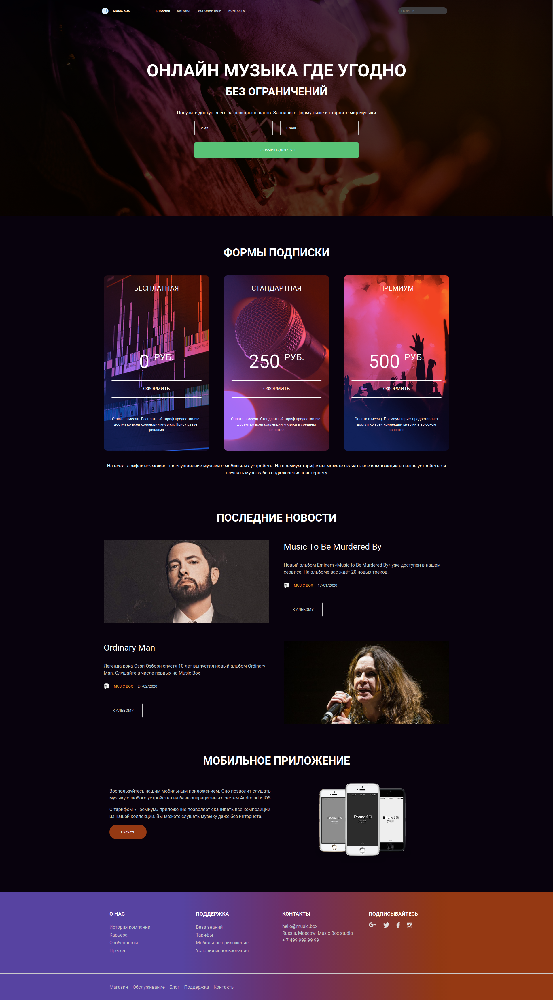
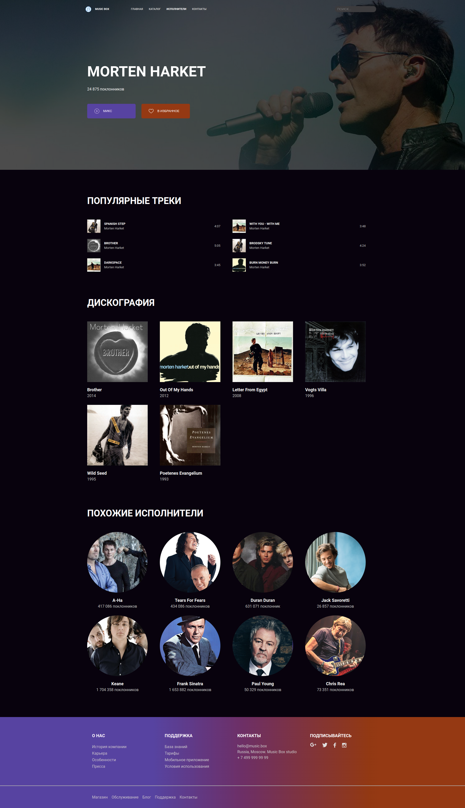

# Music Box

Layout design for "Music Box". Contains two pages: "[Home](https://viler-music-box.surge.sh/index.html)" and "[Artists](https://viler-music-box.surge.sh/artist.html)".

Technologies used: SCSS, Flexbox, Grid.

**[The project on Surge](https://viler-music-box.surge.sh/)**

## Preview

### Home (Desktop)

### Artists (Desktop)

### Home (Mobile)

### Artists (Mobile)

