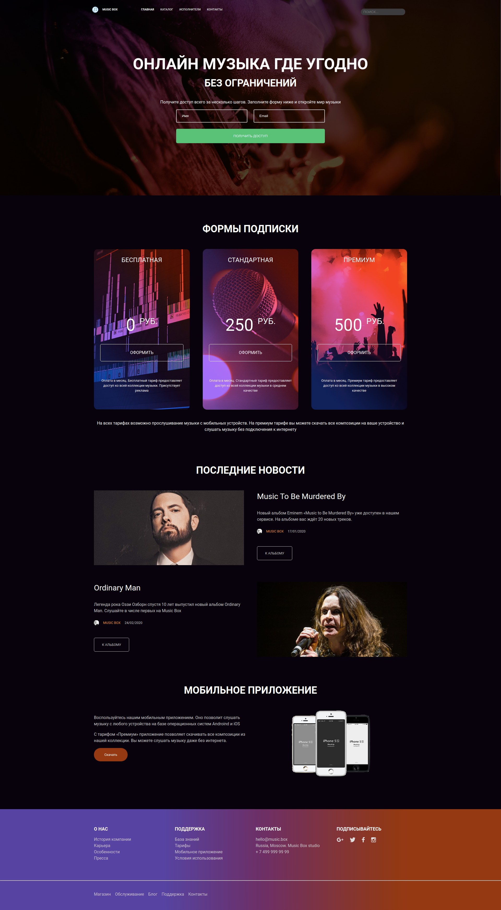

# Music Box

Вёрстка для «Music Box». Состоит из двух страниц: "[Главная](https://viler-music-box.surge.sh/index.html)" и "[Исполнители](https://viler-music-box.surge.sh/artist.html)".

Использованные технологии: SCSS, Flexbox, Grid.

**[Проект на Surge](https://viler-music-box.surge.sh/)**

## Превью

### Главная (Десктоп)

### Исполнители (Десктоп)

### Главная (Мобильные устройства)

### Исполнители (Мобильные устройства)

